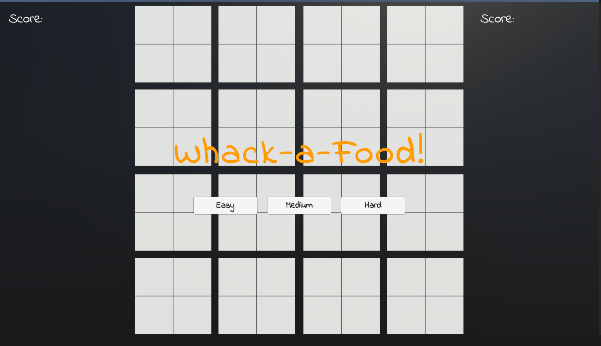

# Whak-a-Food - A Whack-a-Mole Style Browser Game

Welcome to Whak-a-Food, a delightful and mouthwatering browser game inspired by the classic Whack-a-Mole! Test your reflexes and satisfy your appetite as you "whak" your way through an array of delicious foods. Developed using Unity, this simple, yet addictive game is designed for web browsers, making it a perfect pastime.

## How to play

-   Whak the Foods: Use your mouse or tap the screen to "whak" the tasty foods that pop up from their hiding places.

-   Don't Miss: Be quick! Some foods are sneaky and disappear faster than you can whak them.

-   Achieve High Scores: Rack up points by whacking as many foods as you can. Aim for combos and beat your previous high score!

## Play Now

Satisfy your hunger for fun by playing Whak-a-Food right in your web browser. [Play Whak-a-Food Now](https://aliqadir.itch.io/whack-a-food)

## Features

-   Simple and Addictive: Easy-to-pick-up gameplay provides endless entertainment.
-   Mouthwatering Foods: Whak your way through a variety of delectable dishes.
-   Browser-Ready: No downloads required—play instantly in your web browser.

## Credits

Game Developed by Ali Qadir
Assets from Unity Learn
Made in Unity

## License

This project is licensed under the MIT License. Feel free to modify and use any of the code for your own purposes, but please credit the original author if you share or distribute any modified versions of this project. See the [LICENSE](./LICENSEtxt) file for details.

## Contact

If you have any questions or suggestions, feel free to contact me at [LinkedIn](https://www.linkedin.com/in/ali--qadir/) or [Instagram](https://www.instagram.com/oily.oli/).
